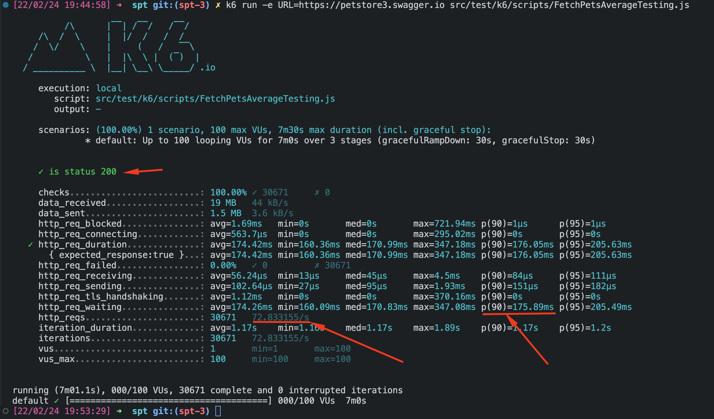

# Petstore Testing

<!-- TOC -->
* [Petstore Testing](#petstore-testing)
    * [Tools used](#tools-used)
    * [Requirements to run the project](#requirements-to-run-the-project)
  * [First task: API test automation](#first-task-api-test-automation)
    * [To run API tests](#to-run-api-tests)
    * [Test Report](#test-report)
    * [Tests Design](#tests-design)
    * [Acceptance Test](#acceptance-test)
    * [Extras and faced challenges](#extras-and-faced-challenges)
  * [Second task: API performance test](#second-task-api-performance-test)
    * [Tests](#tests)
      * [Design considerations](#design-considerations)
      * [Average-load test](#average-load-test)
      * [From the Report:](#from-the-report)
      * [What to do if tests are failing](#what-to-do-if-test-are-failing)
    * [Run k6 tests](#run-k6-tests)
<!-- TOC -->

### Tools used

- Serenity
- Rest Assured
- Maven (because the original petstore project uses maven)
- k6

### Requirements to run the project

Have installed in your machine:

- Java > v17
- Maven
- [k6](https://grafana.com/docs/k6/latest/get-started/installation/)

**Recommendation**: Use [SDKMan!](https://sdkman.io) to install Java and Maven

Clone the project with:
```shell
  git clone git@github.com:krantos/spt.git
```

## First task: API test automation

### To run API tests

Integration tests includes `pre-integration-test` to start `jetty` server and `post-integration-test` to stop it.

In a new terminal in the root path of the project and run:

- Profile `dev` To run tests using local server

    ```shell
    mvn verify -Pdev
    ```

- Profile `prod` to run tests using prd version

  ```shell
  mvn verify -Pprod
  ```

- Open the report by opening the file 

  ```shell
  /spt/target/site/serenity/index.html
  ```

### Tests Design

To test `pets/findByTag` endpoint I have decided to run functional tests to cover major cases.
In the table below you will find each covered case.
The objective is to consider every possible case for the specified endpoint. And with the same
mindset, we can cover each endpoint.

| Endpoint        | Tests                                                                                  |
|-----------------|----------------------------------------------------------------------------------------|
| `pet/fetchById` | Validate that fetching pets with `tag` should return pets that include the same `tag`. |
|                 | Validate that pets include at least one tag on a multiple tag request                  |
|                 | Validate empty collection response for an unknown tag                                  |
|                 | Validate error message for empty tag                                                   |
|                 | Validate JSON Schema response                                                          |

### Acceptance Test

Given a specific user flow a test is created to validate a common scenario.
This user flow will include the next endpoints

- `/user/login` with a `get` action that includes auth data
- `/pet` with `post` action to create a new pet (includes sessionId from previous call)
- `/pet` with `get` action to retrieve information
- body validation agains prior data.

```gherkin
Given I am authenticated
And I add my new pet Sun
When I ask for a pet with Sun's id
Then I get Sun data as result
```

### Extras and faced challenges

To smoothly run the tests I worked in the following extra things:

1. Added missing dependencies to make work put and post actions locally

1. Removed duplicated dependency jars that generated Warnings on Jetty start

1. Added Prettier to format code

1. Added `dev` and `prod` variables to maven profile

## Second task: API performance test

Let's suppose Petsore is a public store where clients
can visit the site and search for pets and buy them.

- Requirements prior to test:
    - Most requested pages or endpoints
    - Amount of request per minute or RPM.
    - User's geolocation (this will impact time response)
    - Monitor and logging system plugged to Petstore server, to collect server resource consumption and debug bottlenecks
    - Have a Production-like server where to execute tests (try to not use prod server unless you want to mess up with
      analytics)
    - If you are using a third party server, look for request limitations. Maybe they have a DDoS security blocker.
    - Remember to shut servers down once you have finished (they cost money)
    - Try to set a server near your real clients

With the previous information we can focus the performance efforts in areas with either bottlenecks or most visited.
Additionally, we can define a base-line to compare future code change in the Petsotre system.

In the case of the system is not being released yet, we can define the base-line in terms of maximum limit response
time.
i.e: If any endpoint takes more than 3 seconds to respond we check it as a failure in the test.

To narrow this exercise I'll focus on one endpoint, that I consider, it will receive most of the requests. `findByTags`.
Why? First, because is the entry point to sell a pet, which makes it critical for the business. The client will purchase
the
product if first can find it. And second, it requires to traverse the Pets table, which
depending on how it was implemented, it can be an expensive process.

### Tests

#### Design considerations

- Exit criteria: the 90th percentile response time should be below 300 ms.

  ```javscript
		http_req_duration: [{
			threshold: 'p(90)<300',
			abortOnFail: true
		}]
  ```

- Type of tests:
    - Average-load testing: how the system performs under typical load.
    - Stress testing: how the system performs when loads are heavier than usual.

#### Average-load test

The goal of an average-load test is to simulate the average amount of activity on a typical day in production.

k6 report:



#### From the Report:

- All requests were successful
- P90th is below the maximum threshold
- From the 72.83 req/s
    - To RPM: * 60 s/min = 4370 req/min
- If we consider that a user can easily do 2 calls per minute while searching for a pet, we can say that this endpoint
  can handle at least 2186 users per minute.
  Ideally we could compare it against real data and evaluate such assumption. (Google Analytics is a good resource for
  real data)

#### What to do if test are failing

1. Go to the development team and present the evidence
2. After code changes and run tests again (at least 5 times and do the avg of each result)
3. Keep repeating step 2 until you are happy with the results.

### Run k6 tests

Open a new terminal in the root path of the project and execute:

```shell
k6 run -e URL=https://petstore3.swagger.io src/test/k6/scripts/FetchPetsAverageTesting.js
```
